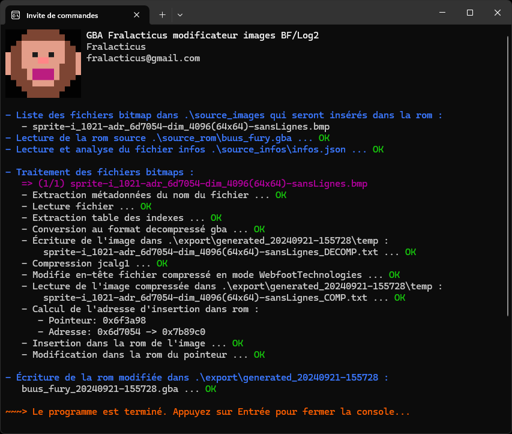

# 🐒Fralacticus - Modificateur d'images des jeux GBA Buu's Fury et Legacy of Goku 2

## 🎮Description

Ce logiciel est un outil automatisé permettant de réinsérer des fichiers .bmp modifiés des jeux GBA DBZ Buu's Fury et l'Héritage de Goku 2 (Legacy of Goku 2), après extraction via le logiciel [fralacticus-chercheur-image](https://github.com/Fralacticus/fralacticus-chercheur-image). 

## 💻Utilisation

> ℹ️ **Note** : Les étapes 1 à 4 ne sont nécessaires qu'une seule fois lors de la première configuration.

1. **Extraction des images** : Utilisez le logiciel [fralacticus-chercheur-image](https://github.com/Fralacticus/fralacticus-chercheur-image) pour extraire les fichiers **.bmp** et générer le fichier **infos.json**. 

2. **Téléchargement du logiciel** : Clonez ou télécharger ce dépôt (fralacticus_modificateur_images_bf_log2) sur votre ordinateur.

3. **Placement de la rom `.gba`** : Placer la rom *.gba* originale (nommez-la à votre guise) dans le dossier **source_rom**. 

4. **Placement du fichier `.json`** : Copiez le fichier *infos.json* généré dans le dossier **source_infos**.

5. **Modification des images `.bmp`** : Les .bmp extraits peuvent être modifiés avec un logiciel d'édition d'images tel que **Photoshop**.
> ⚠️ **Règles à respecter** :
>
> - Conservez le mode indexé
> - Utilisez uniquement les couleurs de la palette originale
> - Ne renommez pas les fichiers *.bmp*

6. **Placement des images `.bmp` modifiées** : Placez les fichiers .*bmp* modifiés, sans les renommer, dans le dossier **source_images**.

7. **Exécution** : Lancez `fralacticus_modificateur_images_bf_log2.exe` pour réinsérer automatiquement les fichiers *.bmp* modifiés.

   Le logiciel génère une copie modifiée de la rom dans le dossier **export\generated_**, en ajoutant un horodatage au dossier et au nom du fichier.

### 🧠 **Avantage**
Ce mode de fonctionnement permet de **préserver la rom source intacte**. Vous pouvez exécuter le programme autant de fois que nécessaire, tester différentes modifications, et toujours repartir de la rom originale. Cela évite de corrompre la rom d'origine par accident et permet une flexibilité maximale lors des modifications répétées.

## 📜Licences

- Ce projet est sous licence zlib. Consulter le fichier [LICENSE](LICENSE.md) pour plus de détails.

- Ce fichier inclut également les licences des autres ressources utilisées.

  

